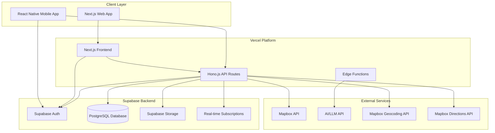

# Design Document

## Overview

Tabi Script is a modern full-stack travel recording application built with Next.js for the web frontend and Hono.js for the API backend, hosted on Vercel with Supabase as the backend-as-a-service platform. The system provides a seamless experience across web and mobile platforms, featuring interactive map visualization, calendar-based schedule management, AI-powered blog generation, and real-time synchronization capabilities.

## Architecture

### High-Level Architecture



### Technology Stack

**Frontend:**

- Web: Next.js 14 with App Router, TypeScript, Tailwind CSS, React Query (TanStack Query)
- Mobile: React Native with Expo, TypeScript, React Navigation, Supabase client
- Maps: Mapbox GL JS for web, react-native-mapbox-gl for mobile
- Calendar: FullCalendar with React wrapper for web, react-native-calendars for mobile

**Backend:**

- API Framework: Hono.js with TypeScript
- Database: Supabase PostgreSQL with Row Level Security
- Authentication: Supabase Auth with social providers
- File Storage: Supabase Storage with CDN
- Real-time: Supabase Real-time subscriptions
- Maps: Mapbox API, Geocoding API, Directions API

**Infrastructure:**

- Hosting: Vercel with Edge Runtime
- Database: Supabase managed PostgreSQL
- CDN: Vercel Edge Network + Supabase CDN
- Monitoring: Vercel Analytics + Supabase Dashboard

## Components and Interfaces

### 1. Next.js Web Application

**Structure:**

```
app/
├── (auth)/
│   ├── login/
│   └── register/
├── dashboard/
├── travel/
│   ├── [id]/
│   │   ├── map/
│   │   ├── calendar/
│   │   └── timeline/
│   └── create/
├── blog/
│   └── [id]/
├── components/
│   ├── Map/
│   │   ├── TravelMap.tsx
│   │   ├── DestinationMarker.tsx
│   │   └── RouteDisplay.tsx
│   ├── Calendar/
│   │   ├── TravelCalendar.tsx
│   │   ├── EventCard.tsx
│   │   └── ScheduleView.tsx
│   └── Travel/
├── api/
│   └── [...route]/
└── globals.css
```

**Key Features:**

- Server-side rendering for SEO optimization
- App Router for nested layouts and loading states
- Optimistic updates with React Query
- Real-time updates via Supabase subscriptions
- Interactive map integration with Google Maps
- Calendar views with drag-and-drop scheduling

### 2. Hono.js API Layer

**API Structure:**

```typescript
// api/index.ts
import { Hono } from 'hono'
import { handle } from 'hono/vercel'
import { authRoutes } from './routes/auth'
import { travelRoutes } from './routes/travel'
import { contentRoutes } from './routes/content'
import { blogRoutes } from './routes/blog'
import { mapRoutes } from './routes/map'
import { calendarRoutes } from './routes/calendar'

const app = new Hono().basePath('/api')

app.route('/auth', authRoutes)
app.route('/travel', travelRoutes)
app.route('/content', contentRoutes)
app.route('/blog', blogRoutes)
app.route('/map', mapRoutes)
app.route('/calendar', calendarRoutes)

export const GET = handle(app)
export const POST = handle(app)
export const PUT = handle(app)
export const DELETE = handle(app)
```

**Key Interfaces:**

```typescript
// Travel Planning API
interface TravelPlanAPI {
  'GET /travel': () => Promise<TravelPlan[]>
  'POST /travel': (data: CreateTravelPlanRequest) => Promise<TravelPlan>
  'PUT /travel/:id': (id: string, data: UpdateTravelPlanRequest) => Promise<TravelPlan>
  'DELETE /travel/:id': (id: string) => Promise<void>
  'POST /travel/:id/destinations': (id: string, destination: Destination) => Promise<TravelPlan>
}

// Map and Route API
interface MapAPI {
  'POST /map/route': (destinations: Destination[]) => Promise<RouteInfo>
  'GET /map/places': (query: string, location?: Coordinates) => Promise<PlaceResult[]>
  'POST /map/geocode': (address: string) => Promise<Coordinates>
  'GET /map/directions': (origin: Coordinates, destination: Coordinates, waypoints?: Coordinates[]) => Promise<DirectionsResult>
}

// Calendar API
interface CalendarAPI {
  'GET /calendar/:travelId': (travelId: string) => Promise<CalendarEvent[]>
  'POST /calendar/event': (event: CreateCalendarEventRequest) => Promise<CalendarEvent>
  'PUT /calendar/event/:id': (id: string, updates: UpdateCalendarEventRequest) => Promise<CalendarEvent>
  'DELETE /calendar/event/:id': (id: string) => Promise<void>
}

// Content Recording API
interface ContentAPI {
  'GET /content/:travelId': (travelId: string) => Promise<TravelPost[]>
  'POST /content': (data: CreatePostRequest) => Promise<TravelPost>
  'POST /content/upload': (file: FormData) => Promise<MediaFile>
  'PUT /content/:id': (id: string, data: UpdatePostRequest) => Promise<TravelPost>
}

// AI Blog Generation API
interface BlogAPI {
  'POST /blog/generate': (travelId: string, preferences: BlogPreferences) => Promise<GeneratedBlog>
  'GET /blog/:id': (id: string) => Promise<GeneratedBlog>
  'PUT /blog/:id': (id: string, content: BlogContent) => Promise<GeneratedBlog>
}
```

### 3. Supabase Integration

**Database Schema:**

```sql
-- Users table (managed by Supabase Auth)
-- Additional user profile data
CREATE TABLE user_profiles (
  id UUID REFERENCES auth.users(id) PRIMARY KEY,
  first_name TEXT,
  last_name TEXT,
  avatar_url TEXT,
  preferences JSONB DEFAULT '{}',
  created_at TIMESTAMP WITH TIME ZONE DEFAULT NOW(),
  updated_at TIMESTAMP WITH TIME ZONE DEFAULT NOW()
);

-- Travels (top-level entity)
CREATE TABLE travels (
  id UUID DEFAULT gen_random_uuid() PRIMARY KEY,
  user_id UUID REFERENCES auth.users(id) ON DELETE CASCADE,
  title TEXT NOT NULL,
  description TEXT,
  start_date DATE,
  end_date DATE,
  status TEXT DEFAULT 'planning',
  cover_image TEXT,
  is_public BOOLEAN DEFAULT false,
  created_at TIMESTAMP WITH TIME ZONE DEFAULT NOW(),
  updated_at TIMESTAMP WITH TIME ZONE DEFAULT NOW()
);

-- Travel plans (planning aspect of travel)
CREATE TABLE travel_plans (
  id UUID DEFAULT gen_random_uuid() PRIMARY KEY,
  travel_id UUID REFERENCES travels(id) ON DELETE CASCADE,
  title TEXT NOT NULL,
  description TEXT,
  start_date DATE,
  end_date DATE,
  is_flexible BOOLEAN DEFAULT true,
  map_center_lat DECIMAL(10, 8),
  map_center_lng DECIMAL(11, 8),
  map_zoom INTEGER DEFAULT 10,
  created_at TIMESTAMP WITH TIME ZONE DEFAULT NOW(),
  updated_at TIMESTAMP WITH TIME ZONE DEFAULT NOW()
);

-- Destinations
CREATE TABLE destinations (
  id UUID DEFAULT gen_random_uuid() PRIMARY KEY,
  travel_id UUID REFERENCES travels(id) ON DELETE CASCADE,
  travel_plan_id UUID REFERENCES travel_plans(id) ON DELETE CASCADE,
  name TEXT NOT NULL,
  address TEXT,
  latitude DECIMAL(10, 8),
  longitude DECIMAL(11, 8),
  planned_date DATE,
  planned_time TIME,
  duration_minutes INTEGER,
  notes TEXT,
  category TEXT,
  order_index INTEGER,
  place_id TEXT, -- Mapbox Place ID
  created_at TIMESTAMP WITH TIME ZONE DEFAULT NOW()
);

-- Calendar events (for scheduled activities)
CREATE TABLE calendar_events (
  id UUID DEFAULT gen_random_uuid() PRIMARY KEY,
  travel_id UUID REFERENCES travels(id) ON DELETE CASCADE,
  travel_plan_id UUID REFERENCES travel_plans(id) ON DELETE CASCADE,
  destination_id UUID REFERENCES destinations(id) ON DELETE CASCADE,
  title TEXT NOT NULL,
  start_datetime TIMESTAMP WITH TIME ZONE NOT NULL,
  end_datetime TIMESTAMP WITH TIME ZONE NOT NULL,
  all_day BOOLEAN DEFAULT false,
  event_type TEXT DEFAULT 'destination',
  color TEXT DEFAULT '#3B82F6',
  notes TEXT,
  created_at TIMESTAMP WITH TIME ZONE DEFAULT NOW(),
  updated_at TIMESTAMP WITH TIME ZONE DEFAULT NOW()
);

-- Routes (calculated routes between destinations)
CREATE TABLE routes (
  id UUID DEFAULT gen_random_uuid() PRIMARY KEY,
  travel_id UUID REFERENCES travels(id) ON DELETE CASCADE,
  travel_plan_id UUID REFERENCES travel_plans(id) ON DELETE CASCADE,
  origin_destination_id UUID REFERENCES destinations(id) ON DELETE CASCADE,
  destination_destination_id UUID REFERENCES destinations(id) ON DELETE CASCADE,
  distance_meters INTEGER,
  duration_seconds INTEGER,
  polyline TEXT,
  route_data JSONB,
  created_at TIMESTAMP WITH TIME ZONE DEFAULT NOW()
);

-- Travel posts
CREATE TABLE travel_posts (
  id UUID DEFAULT gen_random_uuid() PRIMARY KEY,
  travel_id UUID REFERENCES travels(id) ON DELETE CASCADE,
  user_id UUID REFERENCES auth.users(id) ON DELETE CASCADE,
  content TEXT NOT NULL,
  latitude DECIMAL(10, 8),
  longitude DECIMAL(11, 8),
  timestamp TIMESTAMP WITH TIME ZONE DEFAULT NOW(),
  is_offline BOOLEAN DEFAULT false,
  created_at TIMESTAMP WITH TIME ZONE DEFAULT NOW()
);

-- Media files
CREATE TABLE media_files (
  id UUID DEFAULT gen_random_uuid() PRIMARY KEY,
  travel_post_id UUID REFERENCES travel_posts(id) ON DELETE CASCADE,
  storage_path TEXT NOT NULL,
  file_name TEXT NOT NULL,
  file_type TEXT NOT NULL,
  file_size INTEGER,
  metadata JSONB DEFAULT '{}',
  uploaded_at TIMESTAMP WITH TIME ZONE DEFAULT NOW()
);

-- Generated blogs
CREATE TABLE generated_blogs (
  id UUID DEFAULT gen_random_uuid() PRIMARY KEY,
  travel_id UUID REFERENCES travels(id) ON DELETE CASCADE,
  title TEXT NOT NULL,
  content JSONB NOT NULL,
  status TEXT DEFAULT 'draft',
  preferences JSONB DEFAULT '{}',
  generated_at TIMESTAMP WITH TIME ZONE DEFAULT NOW(),
  updated_at TIMESTAMP WITH TIME ZONE DEFAULT NOW()
);
```

**Row Level Security Policies:**

```sql
-- Enable RLS on all tables
ALTER TABLE user_profiles ENABLE ROW LEVEL SECURITY;
ALTER TABLE travels ENABLE ROW LEVEL SECURITY;
ALTER TABLE travel_plans ENABLE ROW LEVEL SECURITY;
ALTER TABLE destinations ENABLE ROW LEVEL SECURITY;
ALTER TABLE calendar_events ENABLE ROW LEVEL SECURITY;
ALTER TABLE routes ENABLE ROW LEVEL SECURITY;
ALTER TABLE travel_posts ENABLE ROW LEVEL SECURITY;
ALTER TABLE media_files ENABLE ROW LEVEL SECURITY;
ALTER TABLE generated_blogs ENABLE ROW LEVEL SECURITY;

-- Users can only access their own data
CREATE POLICY "Users can view own profile" ON user_profiles
  FOR SELECT USING (auth.uid() = id);

CREATE POLICY "Users can update own profile" ON user_profiles
  FOR UPDATE USING (auth.uid() = id);

-- Travel policies (top-level entity)
CREATE POLICY "Users can view own travels" ON travels
  FOR SELECT USING (auth.uid() = user_id);

CREATE POLICY "Users can manage own travels" ON travels
  FOR ALL USING (auth.uid() = user_id);

-- Travel plan policies
CREATE POLICY "Users can view own travel plans" ON travel_plans
  FOR SELECT USING (auth.uid() = (SELECT user_id FROM travels WHERE id = travel_id));

CREATE POLICY "Users can manage own travel plans" ON travel_plans
  FOR ALL USING (auth.uid() = (SELECT user_id FROM travels WHERE id = travel_id));

-- Child entity policies (all reference travel_id)
CREATE POLICY "Users can manage own destinations" ON destinations
  FOR ALL USING (auth.uid() = (SELECT user_id FROM travels WHERE id = travel_id));

CREATE POLICY "Users can manage own calendar events" ON calendar_events
  FOR ALL USING (auth.uid() = (SELECT user_id FROM travels WHERE id = travel_id));

CREATE POLICY "Users can manage own routes" ON routes
  FOR ALL USING (auth.uid() = (SELECT user_id FROM travels WHERE id = travel_id));

CREATE POLICY "Users can manage own travel posts" ON travel_posts
  FOR ALL USING (auth.uid() = (SELECT user_id FROM travels WHERE id = travel_id));

CREATE POLICY "Users can manage own generated blogs" ON generated_blogs
  FOR ALL USING (auth.uid() = (SELECT user_id FROM travels WHERE id = travel_id));
```

### 4. Map Integration Components

**Map Component Architecture:**

```typescript
// Map component interfaces
interface TravelMapProps {
  destinations: Destination[]
  routes: RouteInfo[]
  onDestinationSelect: (destination: Destination) => void
  onDestinationAdd: (coordinates: Coordinates) => void
  onRouteCalculate: (destinations: Destination[]) => void
  center?: Coordinates
  zoom?: number
  showRoutes: boolean
}

interface DestinationMarkerProps {
  destination: Destination
  isSelected: boolean
  onClick: (destination: Destination) => void
  category: DestinationCategory
}

interface RouteDisplayProps {
  route: RouteInfo
  color?: string
  showDetails: boolean
}

// Place search component
interface PlaceSearchProps {
  onPlaceSelect: (place: PlaceResult) => void
  placeholder: string
  location?: Coordinates
  radius?: number
}
```

**Map Features:**

- Interactive Google Maps integration
- Custom markers for different destination categories
- Route visualization with polylines
- Place search with autocomplete
- Geocoding and reverse geocoding
- Distance and duration calculations
- Drag-and-drop marker positioning

### 5. Calendar Integration Components

**Calendar Component Architecture:**

```typescript
// Calendar component interfaces
interface TravelCalendarProps {
  events: CalendarEvent[]
  onEventSelect: (event: CalendarEvent) => void
  onEventUpdate: (eventId: string, updates: Partial<CalendarEvent>) => void
  onEventCreate: (event: CreateCalendarEventRequest) => void
  view: CalendarView
  editable: boolean
}

interface CalendarEventProps {
  event: CalendarEvent
  onEdit: (event: CalendarEvent) => void
  onDelete: (eventId: string) => void
  draggable: boolean
}

interface ScheduleViewProps {
  travelPlan: TravelPlan
  events: CalendarEvent[]
  onScheduleUpdate: (updates: ScheduleUpdate[]) => void
}

type CalendarView = 'month' | 'week' | 'day' | 'agenda'
```

**Calendar Features:**

- Multiple view modes (month, week, day, agenda)
- Drag-and-drop event scheduling
- Color-coded events by category
- Integration with destination data
- Timeline view for itinerary planning
- Conflict detection and resolution

### 6. React Native Mobile Application

**Project Structure:**

```
src/
├── components/
│   ├── Map/
│   │   ├── TravelMap.tsx
│   │   ├── DestinationMarker.tsx
│   │   └── PlaceSearch.tsx
│   ├── Calendar/
│   │   ├── TravelCalendar.tsx
│   │   ├── AgendaView.tsx
│   │   └── EventCard.tsx
│   └── Travel/
├── screens/
│   ├── Auth/
│   ├── Travel/
│   │   ├── TravelMapScreen.tsx
│   │   ├── TravelCalendarScreen.tsx
│   │   └── TravelTimelineScreen.tsx
│   ├── Content/
│   └── Blog/
├── services/
│   ├── supabase.ts
│   ├── api.ts
│   ├── maps.ts
│   └── calendar.ts
├── hooks/
├── utils/
└── types/
```

**Key Features:**

- Expo managed workflow for easier development
- Supabase client for authentication and real-time updates
- React Navigation for navigation
- React Query for data fetching and caching
- Offline support with AsyncStorage
- Native map integration with react-native-maps
- Calendar integration with react-native-calendars
- GPS location services for automatic check-ins

## Data Models

### Core TypeScript Interfaces

```typescript
interface User {
  id: string
  email: string
  firstName?: string
  lastName?: string
  avatarUrl?: string
  preferences: UserPreferences
  createdAt: string
  updatedAt: string
}

interface Travel {
  id: string
  userId: string
  title: string
  description?: string
  startDate?: string
  endDate?: string
  status: TravelStatus
  coverImage?: string
  isPublic: boolean
  plans: TravelPlan[]
  posts: TravelPost[]
  generatedBlogs: GeneratedBlog[]
  createdAt: string
  updatedAt: string
}

interface TravelPlan {
  id: string
  travelId: string
  title: string
  description?: string
  startDate?: string
  endDate?: string
  isFlexible: boolean
  mapCenter?: Coordinates
  mapZoom?: number
  destinations: Destination[]
  routes: RouteInfo[]
  events: CalendarEvent[]
  createdAt: string
  updatedAt: string
}

interface Destination {
  id: string
  travelId: string
  travelPlanId: string
  name: string
  address?: string
  coordinates?: Coordinates
  plannedDate?: string
  plannedTime?: string
  durationMinutes?: number
  notes?: string
  category: DestinationCategory
  orderIndex: number
  placeId?: string
  createdAt: string
}

interface CalendarEvent {
  id: string
  travelId: string
  travelPlanId: string
  destinationId?: string
  title: string
  startDatetime: string
  endDatetime: string
  allDay: boolean
  eventType: EventType
  color: string
  notes?: string
  createdAt: string
  updatedAt: string
}

interface RouteInfo {
  id: string
  travelId: string
  travelPlanId: string
  originDestinationId: string
  destinationDestinationId: string
  distanceMeters: number
  durationSeconds: number
  polyline: string
  routeData: any
  createdAt: string
}

interface Coordinates {
  latitude: number
  longitude: number
}

interface PlaceResult {
  placeId: string
  name: string
  address: string
  coordinates: Coordinates
  category: DestinationCategory
  rating?: number
  photos?: string[]
  openingHours?: string[]
}

interface DirectionsResult {
  routes: RouteInfo[]
  status: string
  geocodedWaypoints: any[]
}

interface TravelPost {
  id: string
  travelId: string
  userId: string
  content: string
  location?: Coordinates
  mediaFiles: MediaFile[]
  timestamp: string
  isOffline: boolean
  createdAt: string
}

interface MediaFile {
  id: string
  travelPostId: string
  storagePath: string
  fileName: string
  fileType: string
  fileSize: number
  metadata: Record<string, any>
  uploadedAt: string
}

interface GeneratedBlog {
  id: string
  travelId: string
  title: string
  content: BlogSection[]
  status: BlogStatus
  preferences: BlogPreferences
  generatedAt: string
  updatedAt: string
}

interface BlogSection {
  id: string
  type: 'intro' | 'day' | 'highlight' | 'conclusion'
  title: string
  content: string
  mediaFiles: MediaFile[]
  order: number
}

type TravelStatus = 'planning' | 'upcoming' | 'active' | 'completed' | 'cancelled'
type DestinationCategory = 'restaurant' | 'attraction' | 'hotel' | 'transport' | 'shopping' | 'other'
type EventType = 'destination' | 'transport' | 'activity' | 'meal' | 'accommodation'
type BlogStatus = 'draft' | 'published' | 'archived'
type CalendarView = 'month' | 'week' | 'day' | 'agenda'
```

## Error Handling

### Map and Location Services Error Handling

```typescript
// Map service error handling
export class MapServiceError extends Error {
  constructor(
    message: string,
    public code: string,
    public details?: any
  ) {
    super(message)
    this.name = 'MapServiceError'
  }
}

// Handle Mapbox API errors
export const handleMapsError = (error: any): never => {
  if (error.code === 'NoRoute') {
    throw new MapServiceError('No route found between destinations', 'NO_ROUTE', error)
  }
  if (error.code === 'RateLimitExceeded') {
    throw new MapServiceError('Mapbox API rate limit exceeded', 'RATE_LIMIT_EXCEEDED', error)
  }
  if (error.code === 'Unauthorized') {
    throw new MapServiceError('Mapbox API unauthorized access', 'UNAUTHORIZED', error)
  }
  if (error.code === 'InvalidInput') {
    throw new MapServiceError('Invalid coordinates or parameters', 'INVALID_INPUT', error)
  }
  throw new MapServiceError(error.message || 'Mapbox service error', 'MAPBOX_ERROR', error)
}

// Location permission handling
export const handleLocationError = (error: GeolocationPositionError): never => {
  switch (error.code) {
    case error.PERMISSION_DENIED:
      throw new MapServiceError('Location access denied by user', 'LOCATION_DENIED')
    case error.POSITION_UNAVAILABLE:
      throw new MapServiceError('Location information unavailable', 'LOCATION_UNAVAILABLE')
    case error.TIMEOUT:
      throw new MapServiceError('Location request timed out', 'LOCATION_TIMEOUT')
    default:
      throw new MapServiceError('Unknown location error', 'LOCATION_ERROR')
  }
}
```

### Supabase Error Handling

```typescript
// Custom error handler for Supabase operations
export class SupabaseError extends Error {
  constructor(
    message: string,
    public code: string,
    public details?: any
  ) {
    super(message)
    this.name = 'SupabaseError'
  }
}

// Error handling utility
export const handleSupabaseError = (error: any): never => {
  if (error.code === 'PGRST301') {
    throw new SupabaseError('Resource not found', '404', error)
  }
  if (error.code === '23505') {
    throw new SupabaseError('Resource already exists', '409', error)
  }
  throw new SupabaseError(error.message || 'Database error', '500', error)
}
```

### API Error Responses

```typescript
// Standardized error response format
interface APIError {
  error: {
    code: string
    message: string
    details?: Record<string, any>
    timestamp: string
  }
}

// Hono.js error handler
app.onError((err, c) => {
  const error: APIError = {
    error: {
      code: err.name || 'INTERNAL_ERROR',
      message: err.message,
      details: err.cause,
      timestamp: new Date().toISOString()
    }
  }

  return c.json(error, err.status || 500)
})
```

## Testing Strategy

### Frontend Testing (Next.js)

```typescript
// Map component testing
import { render, screen, fireEvent } from '@testing-library/react'
import { TravelMap } from '@/components/Map/TravelMap'

test('renders map with destination markers', () => {
  const mockDestinations = [
    {
      id: '1',
      name: 'Tokyo Station',
      coordinates: { latitude: 35.6812, longitude: 139.7671 }
    }
  ]

  render(<TravelMap destinations={mockDestinations} />)
  expect(screen.getByTestId('travel-map')).toBeInTheDocument()
})

// Calendar component testing
import { TravelCalendar } from '@/components/Calendar/TravelCalendar'

test('displays calendar events correctly', () => {
  const mockEvents = [
    {
      id: '1',
      title: 'Visit Tokyo Station',
      startDatetime: '2024-03-15T10:00:00Z',
      endDatetime: '2024-03-15T12:00:00Z'
    }
  ]

  render(<TravelCalendar events={mockEvents} />)
  expect(screen.getByText('Visit Tokyo Station')).toBeInTheDocument()
})
```

### API Testing (Hono.js)

```typescript
// Map API testing
import { testClient } from 'hono/testing'
import { app } from '@/api'

test('POST /api/map/route calculates route correctly', async () => {
  const destinations = [
    { coordinates: { latitude: 35.6812, longitude: 139.7671 } },
    { coordinates: { latitude: 35.6762, longitude: 139.6503 } }
  ]

  const res = await testClient(app).map.route.$post({ json: { destinations } })
  expect(res.status).toBe(200)

  const data = await res.json()
  expect(data.distance).toBeGreaterThan(0)
  expect(data.duration).toBeGreaterThan(0)
})

// Calendar API testing
test('GET /api/calendar/:travelId returns calendar events', async () => {
  const res = await testClient(app).calendar[':travelId'].$get({
    param: { travelId: 'test-travel-id' }
  })
  expect(res.status).toBe(200)

  const data = await res.json()
  expect(Array.isArray(data)).toBe(true)
})
```

### Integration Testing

- Google Maps API integration testing with mock responses
- Calendar drag-and-drop functionality testing
- Real-time synchronization testing between map and calendar views
- Cross-platform data consistency testing

### End-to-End Testing

- **Web:** Playwright for map interaction and calendar scheduling flows
- **Mobile:** Detox for native map and calendar functionality
- **Cross-platform:** Shared test scenarios for feature parity

### Testing Tools

- **Unit/Integration:** Vitest for fast testing
- **Component:** React Testing Library with custom map/calendar utilities
- **API:** Hono testing utilities with Mapbox API mocks
- **E2E:** Playwright (web), Detox (mobile)
- **Database:** Supabase test instance with seed data

## Calendar Library Recommendations

### For Web (Next.js) - FullCalendar v6

FullCalendar is the recommended choice for web calendar functionality due to its comprehensive feature set and excellent React integration.

```typescript
// Installation: npm install @fullcalendar/react @fullcalendar/core @fullcalendar/daygrid @fullcalendar/timegrid @fullcalendar/interaction

import FullCalendar from '@fullcalendar/react'
import dayGridPlugin from '@fullcalendar/daygrid'
import timeGridPlugin from '@fullcalendar/timegrid'
import interactionPlugin from '@fullcalendar/interaction'
import listPlugin from '@fullcalendar/list'

const TravelCalendar = ({ events, onEventUpdate }) => {
  return (
    <FullCalendar
      plugins={[dayGridPlugin, timeGridPlugin, interactionPlugin, listPlugin]}
      headerToolbar={{
        left: 'prev,next today',
        center: 'title',
        right: 'dayGridMonth,timeGridWeek,timeGridDay,listWeek'
      }}
      initialView="dayGridMonth"
      editable={true}
      selectable={true}
      events={events}
      eventDrop={onEventUpdate}
      eventResize={onEventUpdate}
      height="auto"
      eventClassNames={(event) => [`event-${event.extendedProps.category}`]}
    />
  )
}
```

**Benefits of FullCalendar:**

- Excellent drag-and-drop support with smooth animations
- Multiple view types (month, week, day, list, timeline)
- Highly customizable event rendering and styling
- Strong TypeScript support with proper type definitions
- Extensive plugin ecosystem for additional features
- Mobile-responsive design with touch support
- Active development and large community
- Free and open-source

### For Mobile (React Native) - react-native-calendars

react-native-calendars provides native performance and mobile-optimized UX patterns.

```typescript
// Installation: npm install react-native-calendars

import { Calendar, CalendarList, Agenda } from 'react-native-calendars'

const TravelCalendarMobile = ({ events, onDayPress }) => {
  return (
    <Calendar
      onDayPress={onDayPress}
      markedDates={events}
      theme={{
        backgroundColor: '#ffffff',
        calendarBackground: '#ffffff',
        textSectionTitleColor: '#b6c1cd',
        selectedDayBackgroundColor: '#00adf5',
        selectedDayTextColor: '#ffffff',
        todayTextColor: '#00adf5',
        dayTextColor: '#2d4150',
        textDisabledColor: '#d9e1e8'
      }}
    />
  )
}

// For agenda/timeline view
const TravelAgenda = ({ events }) => {
  return (
    <Agenda
      items={events}
      renderItem={(item) => <EventCard event={item} />}
      renderEmptyDate={() => <EmptyDate />}
      rowHasChanged={(r1, r2) => r1.name !== r2.name}
      theme={{
        agendaDayTextColor: '#00adf5',
        agendaDayNumColor: '#00adf5',
        agendaTodayColor: '#00adf5'
      }}
    />
  )
}
```

**Benefits of react-native-calendars:**

- Native performance with smooth scrolling
- Multiple calendar components (Calendar, Agenda, CalendarList)
- Customizable themes and styling options
- Good gesture support for mobile interactions
- Lightweight and well-maintained
- Excellent for mobile UX patterns
- Supports both iOS and Android design patterns

### Implementation Strategy

1. **Web**: Use FullCalendar for rich desktop experience with full drag-and-drop
2. **Mobile**: Use react-native-calendars for native mobile experience
3. **Shared Logic**: Create common event management hooks and utilities
4. **Responsive Design**: Ensure calendar adapts to different screen sizes
5. **Offline Support**: Cache calendar events locally for offline viewing

## Cost Estimation

### Monthly Cost Breakdown (USD)

**Personal/Private Development Phase (0-1000 users):**

| Service | Plan | Monthly Cost | Notes |
|---------|------|--------------|-------|
| **Vercel** | Hobby (Free) | $0 | 100GB bandwidth, unlimited personal projects |
| **Supabase** | Free | $0 | 500MB database, 1GB bandwidth, 1GB file storage |
| **Mapbox** | Free Tier | $0 | 50,000 map loads, 100,000 geocoding requests/month |
| **AI/LLM API** | Groq (Free) | $0 | Free Llama 3.1 70B, rate limited but sufficient for personal use |
| **Domain** | Vercel subdomain | $0 | Use yourapp.vercel.app |
| **Total Personal** | | **$0/month** | Perfect for MVP and personal use |

**Alternative Low-Cost Development:**

| Service | Plan | Monthly Cost | Notes |
|---------|------|--------------|-------|
| **Vercel** | Hobby (Free) | $0 | Use free tier initially |
| **Supabase** | Free | $0 | Upgrade to Pro ($25) only when needed |
| **Mapbox** | Free Tier | $0 | Very generous free tier |
| **AI/LLM API** | Groq/Ollama | $0-5 | Free tier or self-hosted |
| **Domain** | Namecheap | $8/year | ~$0.67/month |
| **Total Low-Cost** | | **$0.67-5.67/month** | Extremely budget-friendly |

### Cost-Effective Architecture for Personal Projects

**Free Tier Maximization Strategy:**

1. **Vercel Hobby Plan (Free)**
   - 100GB bandwidth per month
   - Unlimited personal projects
   - Automatic HTTPS and global CDN
   - Perfect for personal/side projects

2. **Supabase Free Tier**
   - 500MB database (sufficient for thousands of travels)
   - 1GB bandwidth (good for moderate usage)
   - 1GB file storage (optimize images, use compression)
   - Real-time subscriptions included

3. **Mapbox Free Tier**
   - 50,000 map loads per month (very generous)
   - 100,000 geocoding requests
   - Sufficient for personal use and small user base

4. **Free AI Alternatives**
   - **Groq**: Free Llama 3.1 70B API (rate limited but fast)
   - **Ollama**: Self-hosted open-source models
   - **Hugging Face**: Free inference API with rate limits

**Serverless Optimizations:**

```typescript
// Use Vercel Edge Functions for lightweight operations
// api/edge/geocode.ts
import { NextRequest } from 'next/server'

export const config = {
  runtime: 'edge', // Cheaper than Node.js runtime
}

export default async function handler(req: NextRequest) {
  // Lightweight geocoding with caching
  const cached = await getFromCache(address)
  if (cached) return cached

  const result = await mapboxGeocode(address)
  await setCache(address, result, 86400) // 24h cache
  return result
}
```

**Storage Optimization:**

```typescript
// Compress images before upload
const compressImage = async (file: File) => {
  const canvas = document.createElement('canvas')
  const ctx = canvas.getContext('2d')
  const img = new Image()

  return new Promise((resolve) => {
    img.onload = () => {
      // Resize to max 1200px width, 80% quality
      canvas.width = Math.min(1200, img.width)
      canvas.height = (canvas.width / img.width) * img.height

      ctx.drawImage(img, 0, 0, canvas.width, canvas.height)
      canvas.toBlob(resolve, 'image/jpeg', 0.8)
    }
    img.src = URL.createObjectURL(file)
  })
}
```

**Database Optimization for Free Tier:**

```sql
-- Efficient indexing for 500MB limit
CREATE INDEX idx_travels_user_status ON travels(user_id, status);
CREATE INDEX idx_destinations_travel_order ON destinations(travel_id, order_index);
CREATE INDEX idx_posts_travel_timestamp ON travel_posts(travel_id, timestamp DESC);

-- Automatic cleanup of old data
CREATE OR REPLACE FUNCTION cleanup_old_data()
RETURNS void AS $$
BEGIN
  -- Archive travels older than 2 years
  UPDATE travels
  SET status = 'archived'
  WHERE created_at < NOW() - INTERVAL '2 years'
  AND status = 'completed';
END;
$$ LANGUAGE plpgsql;
```

**Growth Phase (1,000-10,000 users):**

| Service | Plan | Monthly Cost | Notes |
|---------|------|--------------|-------|
| **Vercel** | Pro | $20-40 | May need additional bandwidth |
| **Supabase** | Pro | $25-75 | May need database scaling or Team plan |
| **Mapbox** | Pay-as-you-go | $50-150 | ~10,000-30,000 map loads, 5,000-15,000 geocoding |
| **AI/LLM API** | OpenAI GPT-4 | $100-300 | ~200-600 blog generations |
| **Monitoring** | Sentry/LogRocket | $26-50 | Error tracking and performance monitoring |
| **Total Growth** | | **$221-615/month** | |

**Scale Phase (10,000+ users):**

| Service | Plan | Monthly Cost | Notes |
|---------|------|--------------|-------|
| **Vercel** | Enterprise | $400+ | Custom pricing for high traffic |
| **Supabase** | Team/Enterprise | $599+ | Dedicated resources, priority support |
| **Mapbox** | Pay-as-you-go | $500-1,500 | ~100,000+ map loads, 50,000+ geocoding |
| **AI/LLM API** | OpenAI GPT-4 | $1,000-3,000 | ~2,000-6,000 blog generations |
| **CDN** | Cloudflare Pro | $20 | Additional CDN for global performance |
| **Monitoring** | DataDog/New Relic | $100-300 | Advanced monitoring and analytics |
| **Total Scale** | | **$2,619-5,819/month** | |

### Cost Optimization Strategies

**Immediate Optimizations:**

1. **Mapbox**: Use vector tiles caching to reduce API calls
2. **AI Costs**: Implement blog caching, use GPT-3.5 for drafts, GPT-4 for final generation
3. **Supabase**: Optimize database queries, implement proper indexing
4. **Vercel**: Use ISR (Incremental Static Regeneration) for static content

**Medium-term Optimizations:**

1. **Image Optimization**: Use Vercel's image optimization or Supabase's image transformations
2. **Caching Strategy**: Implement Redis caching for frequently accessed data
3. **API Rate Limiting**: Prevent abuse and control costs
4. **Batch Processing**: Group AI requests to reduce per-request overhead

**Long-term Optimizations:**

1. **Self-hosted AI**: Consider running open-source models for basic blog generation
2. **Multi-region**: Use Supabase's multi-region setup for global users
3. **Custom CDN**: Implement custom caching strategies for map tiles
4. **Database Optimization**: Archive old data, implement data lifecycle policies

### Revenue Considerations

**Freemium Model Suggestions:**

- **Free Tier**: 3 travels, basic blog generation, standard map features
- **Pro Tier ($9.99/month)**: Unlimited travels, advanced AI features, premium map styles
- **Team Tier ($19.99/month)**: Collaboration features, export options, priority support

**Break-even Analysis:**

- **Development Phase**: ~7-10 Pro subscribers
- **Growth Phase**: ~25-65 Pro subscribers
- **Scale Phase**: ~300-650 Pro subscribers

### Cost Per User Estimates

| Phase | Monthly Cost per Active User |
|-------|------------------------------|
| Development (100-1,000 users) | $0.06-0.91 |
| Growth (1,000-10,000 users) | $0.02-0.62 |
| Scale (10,000+ users) | $0.05-0.58 |

### Risk Factors and Mitigation

**High-Risk Cost Areas:**

1. **AI API Costs**: Can spike with heavy usage
   - *Mitigation*: Implement usage limits, caching, and user quotas
2. **Mapbox Costs**: Map-heavy usage can be expensive
   - *Mitigation*: Implement tile caching, lazy loading, and usage analytics
3. **Database Costs**: Large media files and high query volume
   - *Mitigation*: Use Supabase Storage efficiently, implement query optimization

**Monitoring and Alerts:**

- Set up billing alerts at 80% of budget thresholds
- Monitor per-user costs and usage patterns
- Implement cost attribution by feature to identify expensive operations

### Personal Project Recommendations

**Recommended Stack for $0/month:**

- **Hosting**: Vercel Hobby (Free)
- **Database**: Supabase Free (500MB)
- **Maps**: Mapbox Free (50k loads/month)
- **AI**: Groq Free (Llama 3.1 70B)
- **Domain**: yourapp.vercel.app (Free)
- **Monitoring**: Vercel Analytics (Free)

**When to Upgrade:**

- **Supabase Pro ($25/month)**: When you hit 500MB database limit or need more bandwidth
- **Custom Domain ($8/year)**: When you want professional branding
- **Vercel Pro ($20/month)**: When you exceed 100GB bandwidth or need team features

**Alternative AI Services for Cost Savings:**

```typescript
// Groq (Free tier with Llama 3.1 70B)
import Groq from 'groq-sdk'

const groq = new Groq({
  apiKey: process.env.GROQ_API_KEY,
})

const generateBlog = async (travelData: TravelData) => {
  const completion = await groq.chat.completions.create({
    messages: [
      {
        role: "system",
        content: "You are a travel blog writer. Create engaging travel blogs from user data."
      },
      {
        role: "user",
        content: `Create a travel blog from this data: ${JSON.stringify(travelData)}`
      }
    ],
    model: "llama-3.1-70b-versatile",
    temperature: 0.7,
    max_tokens: 2000,
  })

  return completion.choices[0]?.message?.content
}

// Ollama (Self-hosted, completely free)
const generateBlogLocal = async (travelData: TravelData) => {
  const response = await fetch('http://localhost:11434/api/generate', {
    method: 'POST',
    headers: { 'Content-Type': 'application/json' },
    body: JSON.stringify({
      model: 'llama3.1:8b',
      prompt: `Create a travel blog from this data: ${JSON.stringify(travelData)}`,
      stream: false
    })
  })

  const result = await response.json()
  return result.response
}
```

**Cost Growth Path:**

1. **Phase 1**: $0/month (MVP, personal use)
2. **Phase 2**: $25-33/month (Supabase Pro + domain)
3. **Phase 3**: $45-53/month (+ Vercel Pro)
4. **Phase 4**: Scale based on actual usage

## Security and CDN Considerations

### Vercel Security Features

**Built-in Security (Free Tier):**

- **Global CDN**: Automatic edge caching across 40+ regions worldwide
- **DDoS Protection**: Basic protection against common volumetric attacks
- **SSL/TLS**: Automatic HTTPS with Let's Encrypt certificates
- **Edge Runtime**: Isolated execution environment for serverless functions
- **Geographic Distribution**: Requests served from nearest edge location

**Limitations of Free Tier:**

- **DDoS Protection**: Basic level, suitable for small-medium attacks
- **WAF**: No Web Application Firewall on free tier
- **Advanced Security**: Limited compared to enterprise solutions
- **Rate Limiting**: Must be implemented at application level

### Enhanced Security Stack (Still Free)

**1. Cloudflare Free + Vercel (Recommended)**

```typescript
// DNS Setup: your-domain.com -> Cloudflare -> Vercel
// Benefits:
// - Advanced DDoS protection (free)
// - Web Application Firewall (free tier)
// - Bot protection and challenge pages
// - Additional caching layer
// - Security analytics and insights
// - SSL/TLS optimization
```

**2. Application-Level Security**

```typescript
// Rate limiting with Vercel Edge Functions
// middleware.ts
import { NextRequest, NextResponse } from 'next/server'

const rateLimiter = new Map<string, number[]>()

export function middleware(request: NextRequest) {
  const ip = request.ip || request.headers.get('x-forwarded-for') || 'anonymous'
  const now = Date.now()
  const windowMs = 15 * 60 * 1000 // 15 minutes
  const maxRequests = 100

  const userRequests = rateLimiter.get(ip) || []
  const recentRequests = userRequests.filter(time => now - time < windowMs)

  if (recentRequests.length >= maxRequests) {
    return new NextResponse('Too Many Requests', {
      status: 429,
      headers: {
        'Retry-After': '900' // 15 minutes
      }
    })
  }

  recentRequests.push(now)
  rateLimiter.set(ip, recentRequests)

  return NextResponse.next()
}

export const config = {
  matcher: ['/api/:path*']
}
```

**3. Supabase Security Policies**

```sql
-- Rate limiting at database level
CREATE POLICY "Rate limit travel creation" ON travels
FOR INSERT TO authenticated
WITH CHECK (
  (SELECT COUNT(*) FROM travels
   WHERE user_id = auth.uid()
   AND created_at > NOW() - INTERVAL '1 hour') < 5
);

-- Prevent data abuse
CREATE POLICY "Limit post creation" ON travel_posts
FOR INSERT TO authenticated
WITH CHECK (
  (SELECT COUNT(*) FROM travel_posts
   WHERE user_id = auth.uid()
   AND created_at > NOW() - INTERVAL '1 day') < 50
);

-- Block suspicious activity
CREATE OR REPLACE FUNCTION check_user_activity()
RETURNS TRIGGER AS $$
BEGIN
  -- Log suspicious activity
  IF (SELECT COUNT(*) FROM travels
      WHERE user_id = NEW.user_id
      AND created_at > NOW() - INTERVAL '5 minutes') > 10 THEN
    RAISE EXCEPTION 'Suspicious activity detected';
  END IF;

  RETURN NEW;
END;
$$ LANGUAGE plpgsql;

CREATE TRIGGER prevent_abuse
  BEFORE INSERT ON travels
  FOR EACH ROW
  EXECUTE FUNCTION check_user_activity();
```

### Security Comparison

| Security Layer | Vercel Only | Vercel + Cloudflare | Cost |
|----------------|-------------|---------------------|------|
| **DDoS Protection** | Basic | Advanced | $0 |
| **WAF** | None | Yes (Free tier) | $0 |
| **Bot Protection** | Limited | Advanced | $0 |
| **SSL/TLS** | Yes | Enhanced | $0 |
| **Caching** | Edge CDN | Dual-layer | $0 |
| **Analytics** | Basic | Detailed | $0 |

### Recommended Security Implementation

**Phase 1: Launch (Vercel Only)**

- Use Vercel's built-in CDN and basic DDoS protection
- Implement application-level rate limiting
- Set up Supabase RLS policies
- Monitor with Vercel Analytics

**Phase 2: Growth (Add Cloudflare)**

- Get custom domain and proxy through Cloudflare
- Enable Cloudflare's free WAF and DDoS protection
- Set up security rules and bot protection
- Monitor security events

**Phase 3: Scale (Paid Security)**

- Upgrade to Cloudflare Pro ($20/month) for advanced features
- Consider Vercel Pro for enhanced DDoS protection
- Add monitoring tools like Sentry for error tracking

**Security Monitoring**

```typescript
// Simple security logging
const logSecurityEvent = async (event: SecurityEvent) => {
  await supabase
    .from('security_logs')
    .insert({
      event_type: event.type,
      ip_address: event.ip,
      user_agent: event.userAgent,
      timestamp: new Date().toISOString(),
      details: event.details
    })
}

// Usage in API routes
if (rateLimitExceeded) {
  await logSecurityEvent({
    type: 'RATE_LIMIT_EXCEEDED',
    ip: request.ip,
    userAgent: request.headers.get('user-agent'),
    details: { endpoint: request.url }
  })
}
```

**Conclusion**: Vercel provides solid basic security for personal projects, and combining it with Cloudflare's free tier gives you enterprise-level protection at $0 cost. This setup can handle most security threats and DDoS attacks that a personal travel app would encounter.

This cost-effective approach allows you to build and test Tabi Script completely free, then scale costs gradually as the application grows and generates value.
