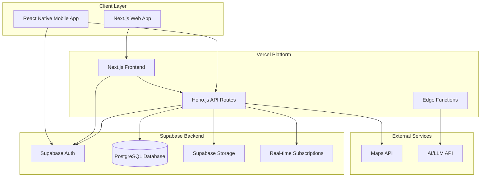

# Design Document

## Overview

Tabi Script is a modern full-stack travel recording application built with Next.js for the web frontend and Hono.js for the API backend, hosted on Vercel with Supabase as the backend-as-a-service platform. The system provides a seamless experience across web and mobile platforms, leveraging Vercel's edge functions for optimal performance and Supabase's real-time capabilities for instant synchronization.

## Architecture

### High-Level Architecture



### Technology Stack

**Frontend:**

- Web: Next.js 14 with App Router, TypeScript, Tailwind CSS, React Query (TanStack Query)
- Mobile: React Native with Expo, TypeScript, React Navigation, Supabase client

**Backend:**

- API Framework: Hono.js with TypeScript
- Database: Supabase PostgreSQL with Row Level Security
- Authentication: Supabase Auth with social providers
- File Storage: Supabase Storage with CDN
- Real-time: Supabase Real-time subscriptions

**Infrastructure:**

- Hosting: Vercel with Edge Runtime
- Database: Supabase managed PostgreSQL
- CDN: Vercel Edge Network + Supabase CDN
- Monitoring: Vercel Analytics + Supabase Dashboard

## Components and Interfaces

### 1. Next.js Web Application

**Structure:**

```
app/
├── (auth)/
│   ├── login/
│   └── register/
├── dashboard/
├── travel/
│   ├── [id]/
│   └── create/
├── blog/
│   └── [id]/
├── api/
│   └── [...route]/
└── globals.css
```

**Key Features:**

- Server-side rendering for SEO optimization
- App Router for nested layouts and loading states
- Optimistic updates with React Query
- Real-time updates via Supabase subscriptions

### 2. Hono.js API Layer

**API Structure:**

```typescript
// api/index.ts
import { Hono } from 'hono'
import { handle } from 'hono/vercel'
import { authRoutes } from './routes/auth'
import { travelRoutes } from './routes/travel'
import { contentRoutes } from './routes/content'
import { blogRoutes } from './routes/blog'

const app = new Hono().basePath('/api')

app.route('/auth', authRoutes)
app.route('/travel', travelRoutes)
app.route('/content', contentRoutes)
app.route('/blog', blogRoutes)

export const GET = handle(app)
export const POST = handle(app)
export const PUT = handle(app)
export const DELETE = handle(app)
```

**Key Interfaces:**

```typescript
// Travel Planning API
interface TravelPlanAPI {
  'GET /travel': () => Promise<TravelPlan[]>
  'POST /travel': (data: CreateTravelPlanRequest) => Promise<TravelPlan>
  'PUT /travel/:id': (id: string, data: UpdateTravelPlanRequest) => Promise<TravelPlan>
  'DELETE /travel/:id': (id: string) => Promise<void>
  'POST /travel/:id/destinations': (id: string, destination: Destination) => Promise<TravelPlan>
}

// Content Recording API
interface ContentAPI {
  'GET /content/:travelId': (travelId: string) => Promise<TravelPost[]>
  'POST /content': (data: CreatePostRequest) => Promise<TravelPost>
  'POST /content/upload': (file: FormData) => Promise<MediaFile>
  'PUT /content/:id': (id: string, data: UpdatePostRequest) => Promise<TravelPost>
}

// AI Blog Generation API
interface BlogAPI {
  'POST /blog/generate': (travelId: string, preferences: BlogPreferences) => Promise<GeneratedBlog>
  'GET /blog/:id': (id: string) => Promise<GeneratedBlog>
  'PUT /blog/:id': (id: string, content: BlogContent) => Promise<GeneratedBlog>
}
```

### 3. Supabase Integration

**Database Schema:**

```sql
-- Users table (managed by Supabase Auth)
-- Additional user profile data
CREATE TABLE user_profiles (
  id UUID REFERENCES auth.users(id) PRIMARY KEY,
  first_name TEXT,
  last_name TEXT,
  avatar_url TEXT,
  preferences JSONB DEFAULT '{}',
  created_at TIMESTAMP WITH TIME ZONE DEFAULT NOW(),
  updated_at TIMESTAMP WITH TIME ZONE DEFAULT NOW()
);

-- Travel plans
CREATE TABLE travel_plans (
  id UUID DEFAULT gen_random_uuid() PRIMARY KEY,
  user_id UUID REFERENCES auth.users(id) ON DELETE CASCADE,
  title TEXT NOT NULL,
  description TEXT,
  start_date DATE,
  end_date DATE,
  is_flexible BOOLEAN DEFAULT true,
  created_at TIMESTAMP WITH TIME ZONE DEFAULT NOW(),
  updated_at TIMESTAMP WITH TIME ZONE DEFAULT NOW()
);

-- Destinations
CREATE TABLE destinations (
  id UUID DEFAULT gen_random_uuid() PRIMARY KEY,
  travel_plan_id UUID REFERENCES travel_plans(id) ON DELETE CASCADE,
  name TEXT NOT NULL,
  address TEXT,
  latitude DECIMAL(10, 8),
  longitude DECIMAL(11, 8),
  planned_date DATE,
  notes TEXT,
  category TEXT,
  order_index INTEGER,
  created_at TIMESTAMP WITH TIME ZONE DEFAULT NOW()
);

-- Travel posts
CREATE TABLE travel_posts (
  id UUID DEFAULT gen_random_uuid() PRIMARY KEY,
  user_id UUID REFERENCES auth.users(id) ON DELETE CASCADE,
  travel_plan_id UUID REFERENCES travel_plans(id) ON DELETE CASCADE,
  content TEXT NOT NULL,
  latitude DECIMAL(10, 8),
  longitude DECIMAL(11, 8),
  timestamp TIMESTAMP WITH TIME ZONE DEFAULT NOW(),
  is_offline BOOLEAN DEFAULT false,
  created_at TIMESTAMP WITH TIME ZONE DEFAULT NOW()
);

-- Media files
CREATE TABLE media_files (
  id UUID DEFAULT gen_random_uuid() PRIMARY KEY,
  travel_post_id UUID REFERENCES travel_posts(id) ON DELETE CASCADE,
  storage_path TEXT NOT NULL,
  file_name TEXT NOT NULL,
  file_type TEXT NOT NULL,
  file_size INTEGER,
  metadata JSONB DEFAULT '{}',
  uploaded_at TIMESTAMP WITH TIME ZONE DEFAULT NOW()
);

-- Generated blogs
CREATE TABLE generated_blogs (
  id UUID DEFAULT gen_random_uuid() PRIMARY KEY,
  travel_plan_id UUID REFERENCES travel_plans(id) ON DELETE CASCADE,
  title TEXT NOT NULL,
  content JSONB NOT NULL,
  status TEXT DEFAULT 'draft',
  preferences JSONB DEFAULT '{}',
  generated_at TIMESTAMP WITH TIME ZONE DEFAULT NOW(),
  updated_at TIMESTAMP WITH TIME ZONE DEFAULT NOW()
);
```

**Row Level Security Policies:**

```sql
-- Enable RLS on all tables
ALTER TABLE user_profiles ENABLE ROW LEVEL SECURITY;
ALTER TABLE travel_plans ENABLE ROW LEVEL SECURITY;
ALTER TABLE destinations ENABLE ROW LEVEL SECURITY;
ALTER TABLE travel_posts ENABLE ROW LEVEL SECURITY;
ALTER TABLE media_files ENABLE ROW LEVEL SECURITY;
ALTER TABLE generated_blogs ENABLE ROW LEVEL SECURITY;

-- Users can only access their own data
CREATE POLICY "Users can view own profile" ON user_profiles
  FOR SELECT USING (auth.uid() = id);

CREATE POLICY "Users can update own profile" ON user_profiles
  FOR UPDATE USING (auth.uid() = id);

CREATE POLICY "Users can view own travel plans" ON travel_plans
  FOR SELECT USING (auth.uid() = user_id);

CREATE POLICY "Users can manage own travel plans" ON travel_plans
  FOR ALL USING (auth.uid() = user_id);
```

### 4. React Native Mobile Application

**Project Structure:**

```
src/
├── components/
├── screens/
│   ├── Auth/
│   ├── Travel/
│   ├── Content/
│   └── Blog/
├── services/
│   ├── supabase.ts
│   └── api.ts
├── hooks/
├── utils/
└── types/
```

**Key Features:**

- Expo managed workflow for easier development
- Supabase client for authentication and real-time updates
- React Navigation for navigation
- React Query for data fetching and caching
- Offline support with AsyncStorage

## Data Models

### Core TypeScript Interfaces

```typescript
interface User {
  id: string
  email: string
  firstName?: string
  lastName?: string
  avatarUrl?: string
  preferences: UserPreferences
  createdAt: string
  updatedAt: string
}

interface TravelPlan {
  id: string
  userId: string
  title: string
  description?: string
  startDate?: string
  endDate?: string
  isFlexible: boolean
  destinations: Destination[]
  posts: TravelPost[]
  createdAt: string
  updatedAt: string
}

interface Destination {
  id: string
  travelPlanId: string
  name: string
  address?: string
  coordinates?: {
    latitude: number
    longitude: number
  }
  plannedDate?: string
  notes?: string
  category: DestinationCategory
  orderIndex: number
  createdAt: string
}

interface TravelPost {
  id: string
  userId: string
  travelPlanId: string
  content: string
  location?: {
    latitude: number
    longitude: number
  }
  mediaFiles: MediaFile[]
  timestamp: string
  isOffline: boolean
  createdAt: string
}

interface MediaFile {
  id: string
  travelPostId: string
  storagePath: string
  fileName: string
  fileType: string
  fileSize: number
  metadata: Record<string, any>
  uploadedAt: string
}

interface GeneratedBlog {
  id: string
  travelPlanId: string
  title: string
  content: BlogSection[]
  status: BlogStatus
  preferences: BlogPreferences
  generatedAt: string
  updatedAt: string
}

interface BlogSection {
  id: string
  type: 'intro' | 'day' | 'highlight' | 'conclusion'
  title: string
  content: string
  mediaFiles: MediaFile[]
  order: number
}

type DestinationCategory = 'restaurant' | 'attraction' | 'hotel' | 'transport' | 'shopping' | 'other'
type BlogStatus = 'draft' | 'published' | 'archived'
```

## Error Handling

### Supabase Error Handling

```typescript
// Custom error handler for Supabase operations
export class SupabaseError extends Error {
  constructor(
    message: string,
    public code: string,
    public details?: any
  ) {
    super(message)
    this.name = 'SupabaseError'
  }
}

// Error handling utility
export const handleSupabaseError = (error: any): never => {
  if (error.code === 'PGRST301') {
    throw new SupabaseError('Resource not found', '404', error)
  }
  if (error.code === '23505') {
    throw new SupabaseError('Resource already exists', '409', error)
  }
  throw new SupabaseError(error.message || 'Database error', '500', error)
}
```

### API Error Responses

```typescript
// Standardized error response format
interface APIError {
  error: {
    code: string
    message: string
    details?: Record<string, any>
    timestamp: string
  }
}

// Hono.js error handler
app.onError((err, c) => {
  const error: APIError = {
    error: {
      code: err.name || 'INTERNAL_ERROR',
      message: err.message,
      details: err.cause,
      timestamp: new Date().toISOString()
    }
  }

  return c.json(error, err.status || 500)
})
```

## Testing Strategy

### Frontend Testing (Next.js)

```typescript
// Component testing with React Testing Library
import { render, screen } from '@testing-library/react'
import { TravelPlanCard } from '@/components/TravelPlanCard'

test('renders travel plan card with title', () => {
  const mockPlan = {
    id: '1',
    title: 'Tokyo Adventure',
    destinations: []
  }

  render(<TravelPlanCard plan={mockPlan} />)
  expect(screen.getByText('Tokyo Adventure')).toBeInTheDocument()
})
```

### API Testing (Hono.js)

```typescript
// API route testing
import { testClient } from 'hono/testing'
import { app } from '@/api'

test('GET /api/travel returns user travel plans', async () => {
  const res = await testClient(app).travel.$get()
  expect(res.status).toBe(200)

  const data = await res.json()
  expect(Array.isArray(data)).toBe(true)
})
```

### Database Testing

```typescript
// Supabase testing with test database
import { createClient } from '@supabase/supabase-js'

const supabaseTest = createClient(
  process.env.SUPABASE_TEST_URL!,
  process.env.SUPABASE_TEST_ANON_KEY!
)

beforeEach(async () => {
  // Clean test database
  await supabaseTest.from('travel_plans').delete().neq('id', '')
})
```

### End-to-End Testing

- **Web:** Playwright for critical user journeys
- **Mobile:** Detox for React Native app testing
- **Cross-platform:** Shared test scenarios for consistency

### Testing Tools

- **Unit/Integration:** Vitest for fast testing
- **Component:** React Testing Library
- **API:** Hono testing utilities
- **E2E:** Playwright (web), Detox (mobile)
- **Database:** Supabase test instance

This design leverages the modern serverless architecture with Next.js and Hono.js on Vercel, combined with Supabase's powerful backend services, providing a scalable and maintainable solution for the Tabi Script travel recording application.
