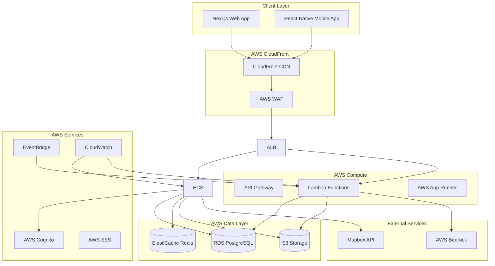
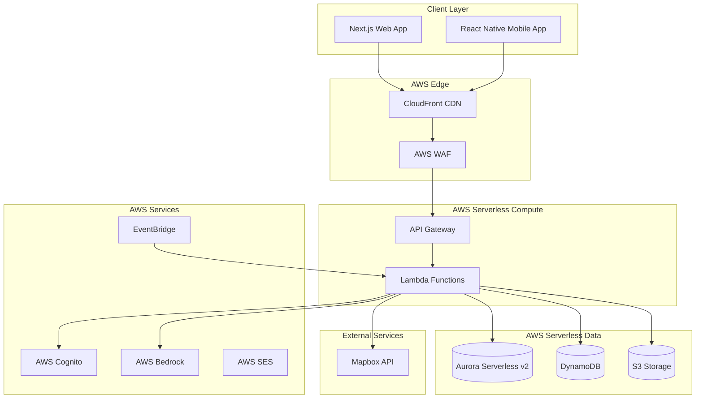

# AWS Design Document

## Overview

This document presents an AWS-based architecture for Tabi Script as an alternative to the Vercel + Supabase approach. This design provides more control, scalability options, and enterprise-grade features, suitable for larger deployments or when specific AWS services are required.

## Architecture

### High-Level AWS Architecture



### Technology Stack

**Frontend:**

- Web: Next.js 14 with App Router, TypeScript, Tailwind CSS
- Mobile: React Native with Expo, TypeScript, React Navigation
- Maps: Mapbox GL JS for web, react-native-mapbox-gl for mobile
- Calendar: FullCalendar for web, react-native-calendars for mobile

**Backend:**

- **Compute**: ECS Fargate for main API, Lambda for serverless functions
- **API Framework**: Hono.js with TypeScript running on Node.js
- **Database**: Amazon RDS PostgreSQL with Multi-AZ deployment
- **Cache**: Amazon ElastiCache Redis for session and data caching
- **Authentication**: AWS Cognito with social identity providers
- **File Storage**: Amazon S3 with CloudFront CDN
- **AI**: AWS Bedrock (Claude 3, Llama 2) for blog generation

**Infrastructure:**

- **CDN**: CloudFront with edge locations worldwide
- **Security**: AWS WAF, Shield Standard, VPC with private subnets
- **Monitoring**: CloudWatch, X-Ray for distributed tracing
- **CI/CD**: AWS CodePipeline, CodeBuild, CodeDeploy
- **DNS**: Route 53 for domain management

## Serverless-First Architecture

### Updated AWS Architecture (Serverless)



### Technology Stack (Serverless)

**Backend:**

- **Compute**: AWS Lambda functions (Node.js 18.x runtime)
- **API Framework**: Hono.js optimized for Lambda
- **Database**: Aurora Serverless v2 PostgreSQL (pay-per-use)
- **Cache**: DynamoDB for sessions, Lambda memory for request caching
- **Authentication**: AWS Cognito with social identity providers
- **File Storage**: Amazon S3 with CloudFront CDN
- **AI**: AWS Bedrock for blog generation

## Components and Interfaces

### 1. Lambda-based API Functions

**Container Configuration:**

```dockerfile
# Dockerfile
FROM node:18-alpine

WORKDIR /app

# Copy package files
COPY package*.json ./
RUN npm ci --only=production

# Copy application code
COPY . .

# Build application
RUN npm run build

EXPOSE 3000

CMD ["npm", "start"]
```

**ECS Task Definition:**

```json
{
  "family": "tabi-script-api",
  "networkMode": "awsvpc",
  "requiresCompatibilities": ["FARGATE"],
  "cpu": "512",
  "memory": "1024",
  "executionRoleArn": "arn:aws:iam::account:role/ecsTaskExecutionRole",
  "taskRoleArn": "arn:aws:iam::account:role/ecsTaskRole",
  "containerDefinitions": [
    {
      "name": "tabi-script-api",
      "image": "account.dkr.ecr.region.amazonaws.com/tabi-script:latest",
      "portMappings": [
        {
          "containerPort": 3000,
          "protocol": "tcp"
        }
      ],
      "environment": [
        {
          "name": "NODE_ENV",
          "value": "production"
        }
      ],
      "secrets": [
        {
          "name": "DATABASE_URL",
          "valueFrom": "arn:aws:secretsmanager:region:account:secret:tabi-script/database"
        }
      ],
      "logConfiguration": {
        "logDriver": "awslogs",
        "options": {
          "awslogs-group": "/ecs/tabi-script",
          "awslogs-region": "us-east-1",
          "awslogs-stream-prefix": "ecs"
        }
      }
    }
  ]
}
```

### 2. Lambda Functions

**Blog Generation Function:**

```typescript
// lambda/blog-generator/index.ts
import { APIGatewayProxyEvent, APIGatewayProxyResult } from 'aws-lambda'
import { BedrockRuntimeClient, InvokeModelCommand } from '@aws-sdk/client-bedrock-runtime'

const bedrock = new BedrockRuntimeClient({ region: 'us-east-1' })

export const handler = async (
  event: APIGatewayProxyEvent
): Promise<APIGatewayProxyResult> => {
  try {
    const { travelId } = JSON.parse(event.body || '{}')

    // Fetch travel data from RDS
    const travelData = await fetchTravelData(travelId)

    // Generate blog using AWS Bedrock
    const prompt = `Create a travel blog from this data: ${JSON.stringify(travelData)}`

    const command = new InvokeModelCommand({
      modelId: 'anthropic.claude-3-sonnet-20240229-v1:0',
      contentType: 'application/json',
      accept: 'application/json',
      body: JSON.stringify({
        anthropic_version: 'bedrock-2023-05-31',
        max_tokens: 2000,
        messages: [
          {
            role: 'user',
            content: prompt
          }
        ]
      })
    })

    const response = await bedrock.send(command)
    const responseBody = JSON.parse(new TextDecoder().decode(response.body))

    return {
      statusCode: 200,
      headers: {
        'Content-Type': 'application/json',
        'Access-Control-Allow-Origin': '*'
      },
      body: JSON.stringify({
        blog: responseBody.content[0].text
      })
    }
  } catch (error) {
    console.error('Blog generation error:', error)
    return {
      statusCode: 500,
      body: JSON.stringify({ error: 'Blog generation failed' })
    }
  }
}
```

**Image Processing Function:**

```typescript
// lambda/image-processor/index.ts
import { S3Event } from 'aws-lambda'
import { S3Client, GetObjectCommand, PutObjectCommand } from '@aws-sdk/client-s3'
import sharp from 'sharp'

const s3 = new S3Client({ region: 'us-east-1' })

export const handler = async (event: S3Event) => {
  for (const record of event.Records) {
    const bucket = record.s3.bucket.name
    const key = decodeURIComponent(record.s3.object.key.replace(/\+/g, ' '))

    try {
      // Get original image
      const getCommand = new GetObjectCommand({ Bucket: bucket, Key: key })
      const response = await s3.send(getCommand)
      const imageBuffer = await streamToBuffer(response.Body)

      // Create thumbnails
      const thumbnail = await sharp(imageBuffer)
        .resize(300, 300, { fit: 'cover' })
        .jpeg({ quality: 80 })
        .toBuffer()

      const medium = await sharp(imageBuffer)
        .resize(800, 600, { fit: 'inside', withoutEnlargement: true })
        .jpeg({ quality: 85 })
        .toBuffer()

      // Upload processed images
      const thumbnailKey = key.replace(/\.[^.]+$/, '_thumb.jpg')
      const mediumKey = key.replace(/\.[^.]+$/, '_medium.jpg')

      await Promise.all([
        s3.send(new PutObjectCommand({
          Bucket: bucket,
          Key: thumbnailKey,
          Body: thumbnail,
          ContentType: 'image/jpeg'
        })),
        s3.send(new PutObjectCommand({
          Bucket: bucket,
          Key: mediumKey,
          Body: medium,
          ContentType: 'image/jpeg'
        }))
      ])

      console.log(`Processed images for ${key}`)
    } catch (error) {
      console.error(`Error processing ${key}:`, error)
    }
  }
}
```

### 3. Aurora Serverless v2 Configuration

**Database Setup:**

```sql
-- Enable required extensions
CREATE EXTENSION IF NOT EXISTS "uuid-ossp";
CREATE EXTENSION IF NOT EXISTS "postgis";
CREATE EXTENSION IF NOT EXISTS "pg_trgm";

-- Same table structure as Supabase design but with AWS-specific optimizations
-- Add indexes for performance
CREATE INDEX CONCURRENTLY idx_travels_user_status_created
ON travels(user_id, status, created_at DESC);

CREATE INDEX CONCURRENTLY idx_destinations_travel_location
ON destinations USING GIST(travel_id, ST_Point(longitude, latitude));

CREATE INDEX CONCURRENTLY idx_posts_travel_timestamp
ON travel_posts(travel_id, timestamp DESC);

-- Partitioning for large tables
CREATE TABLE travel_posts_y2024 PARTITION OF travel_posts
FOR VALUES FROM ('2024-01-01') TO ('2025-01-01');

CREATE TABLE travel_posts_y2025 PARTITION OF travel_posts
FOR VALUES FROM ('2025-01-01') TO ('2026-01-01');
```

**RDS Configuration:**

```yaml
# CloudFormation template snippet
RDSInstance:
  Type: AWS::RDS::DBInstance
  Properties:
    DBInstanceIdentifier: tabi-script-db
    DBInstanceClass: db.t3.micro  # Start small, can scale up
    Engine: postgres
    EngineVersion: '15.4'
    AllocatedStorage: 20
    StorageType: gp2
    StorageEncrypted: true
    MultiAZ: false  # Enable for production
    VPCSecurityGroups:
      - !Ref DatabaseSecurityGroup
    DBSubnetGroupName: !Ref DatabaseSubnetGroup
    BackupRetentionPeriod: 7
    PreferredBackupWindow: "03:00-04:00"
    PreferredMaintenanceWindow: "sun:04:00-sun:05:00"
    DeletionProtection: true
    EnablePerformanceInsights: true
```

### 4. AWS Cognito Authentication

**User Pool Configuration:**

```typescript
// cognito-config.ts
import { CognitoIdentityProviderClient, AdminCreateUserCommand } from '@aws-sdk/client-cognito-identity-provider'

const cognitoClient = new CognitoIdentityProviderClient({ region: 'us-east-1' })

export const cognitoConfig = {
  userPoolId: process.env.COGNITO_USER_POOL_ID!,
  userPoolClientId: process.env.COGNITO_CLIENT_ID!,
  region: 'us-east-1',
  oauth: {
    domain: 'tabi-script.auth.us-east-1.amazoncognito.com',
    scope: ['email', 'openid', 'profile'],
    redirectSignIn: 'https://tabi-script.com/auth/callback',
    redirectSignOut: 'https://tabi-script.com/',
    responseType: 'code'
  }
}

// Custom authentication flow
export const authenticateUser = async (email: string, password: string) => {
  // Implementation using AWS SDK
}
```

### 5. CloudFormation Infrastructure

**Main Stack:**

```yaml
# infrastructure/main.yaml
AWSTemplateFormatVersion: '2010-09-09'
Description: 'Tabi Script Infrastructure'

Parameters:
  Environment:
    Type: String
    Default: dev
    AllowedValues: [dev, staging, prod]

Resources:
  # VPC and Networking
  VPC:
    Type: AWS::EC2::VPC
    Properties:
      CidrBlock: 10.0.0.0/16
      EnableDnsHostnames: true
      EnableDnsSupport: true
      Tags:
        - Key: Name
          Value: !Sub tabi-script-vpc-${Environment}

  # Public Subnets for ALB
  PublicSubnet1:
    Type: AWS::EC2::Subnet
    Properties:
      VpcId: !Ref VPC
      CidrBlock: 10.0.1.0/24
      AvailabilityZone: !Select [0, !GetAZs '']
      MapPublicIpOnLaunch: true

  PublicSubnet2:
    Type: AWS::EC2::Subnet
    Properties:
      VpcId: !Ref VPC
      CidrBlock: 10.0.2.0/24
      AvailabilityZone: !Select [1, !GetAZs '']
      MapPublicIpOnLaunch: true

  # Private Subnets for ECS and RDS
  PrivateSubnet1:
    Type: AWS::EC2::Subnet
    Properties:
      VpcId: !Ref VPC
      CidrBlock: 10.0.3.0/24
      AvailabilityZone: !Select [0, !GetAZs '']

  PrivateSubnet2:
    Type: AWS::EC2::Subnet
    Properties:
      VpcId: !Ref VPC
      CidrBlock: 10.0.4.0/24
      AvailabilityZone: !Select [1, !GetAZs '']

  # ECS Cluster
  ECSCluster:
    Type: AWS::ECS::Cluster
    Properties:
      ClusterName: !Sub tabi-script-${Environment}
      CapacityProviders:
        - FARGATE
        - FARGATE_SPOT
      DefaultCapacityProviderStrategy:
        - CapacityProvider: FARGATE
          Weight: 1
        - CapacityProvider: FARGATE_SPOT
          Weight: 4

  # Application Load Balancer
  ApplicationLoadBalancer:
    Type: AWS::ElasticLoadBalancingV2::LoadBalancer
    Properties:
      Name: !Sub tabi-script-alb-${Environment}
      Scheme: internet-facing
      Type: application
      Subnets:
        - !Ref PublicSubnet1
        - !Ref PublicSubnet2
      SecurityGroups:
        - !Ref ALBSecurityGroup

Outputs:
  VPCId:
    Description: VPC ID
    Value: !Ref VPC
    Export:
      Name: !Sub ${AWS::StackName}-VPC-ID

  ECSClusterName:
    Description: ECS Cluster Name
    Value: !Ref ECSCluster
    Export:
      Name: !Sub ${AWS::StackName}-ECS-Cluster
```

## Cost Estimation

### AWS Monthly Costs

**Development Environment (Serverless):**

| Service | Configuration | Monthly Cost | Notes |
|---------|---------------|--------------|-------|
| **Lambda** | 1M requests, 512MB, 3s avg | $5-10 | All API endpoints |
| **Aurora Serverless v2** | 0.5 ACU min, PostgreSQL | $15-25 | Pay per use, auto-scaling |
| **DynamoDB** | On-demand | $2-5 | Session storage, low usage |
| **S3** | Standard storage | $5-10 | 50GB storage, requests |
| **CloudFront** | Standard | $5-10 | 100GB data transfer |
| **API Gateway** | 1M requests | $3-5 | REST API requests |
| **Cognito** | Pay per MAU | $0-5 | First 50,000 MAUs free |
| **Route 53** | Hosted zone | $0.50 | DNS queries extra |
| **CloudWatch** | Logs and metrics | $3-8 | Lambda logs |
| **Total Development** | | **$38.50-78.50** | 30-40% cheaper than Fargate |

**Production Environment (Serverless):**

| Service | Configuration | Monthly Cost | Notes |
|---------|---------------|--------------|-------|
| **Lambda** | 10M requests, 512MB avg | $25-50 | Auto-scaling, pay per use |
| **Aurora Serverless v2** | 2-16 ACU range | $60-200 | Scales with load |
| **DynamoDB** | On-demand | $10-30 | Session storage, higher usage |
| **S3** | Standard + IA | $20-40 | 500GB storage |
| **CloudFront** | Standard | $20-50 | 1TB data transfer |
| **API Gateway** | 10M requests | $25-35 | REST API requests |
| **Cognito** | Pay per MAU | $10-50 | 10,000-50,000 MAUs |
| **WAF** | Web ACL + rules | $10-20 | Security rules |
| **Route 53** | Hosted zone + queries | $2-5 | DNS management |
| **CloudWatch** | Enhanced monitoring | $15-30 | Detailed metrics |
| **Total Production** | | **$197-510** | Significantly cheaper than Fargate |

**Production Environment:**

| Service | Configuration | Monthly Cost | Notes |
|---------|---------------|--------------|-------|
| **ECS Fargate** | 1 vCPU, 2GB RAM | $50-80 | Auto-scaling 2-10 tasks |
| **RDS PostgreSQL** | db.t3.small, Multi-AZ | $60-80 | High availability |
| **ElastiCache Redis** | cache.t3.small, Multi-AZ | $50-70 | Replication enabled |
| **S3** | Standard + IA | $20-40 | 500GB storage |
| **CloudFront** | Standard | $20-50 | 1TB data transfer |
| **Lambda** | Pay per use | $10-30 | Higher usage |
| **Cognito** | Pay per MAU | $10-50 | 10,000-50,000 MAUs |
| **WAF** | Web ACL + rules | $10-20 | Security rules |
| **Route 53** | Hosted zone + queries | $2-5 | DNS management |
| **CloudWatch** | Enhanced monitoring | $20-40 | Detailed metrics |
| **Total Production** | | **$252-465** | |

### Serverless Cost Benefits

**Why Serverless is More Cost-Effective:**

1. **No Idle Costs**: Pay only when code is running
2. **Auto-scaling**: Scales to zero when not in use
3. **No Infrastructure Management**: No EC2 instances to manage
4. **Built-in High Availability**: Multi-AZ by default

**Lambda Cost Breakdown:**

```typescript
// Example cost calculation for 1M requests/month
// Request cost: 1M * $0.0000002 = $0.20
// Duration cost: 1M * 3s * 512MB * $0.0000166667 = $25.00
// Total: ~$25.20/month for 1M requests

// Compare to Fargate:
// 0.25 vCPU + 0.5GB RAM = ~$15/month running 24/7
// But Lambda only runs when needed!
```

**Aurora Serverless v2 Benefits:**

```yaml
# Scales from 0.5 ACU to 16 ACU automatically
# 0.5 ACU = ~$43/month if running 24/7
# But scales to zero during idle periods
# Typical cost for small app: $15-25/month
```

**DynamoDB On-Demand Pricing:**

```typescript
// Session storage example:
// 100,000 reads/month * $0.25 per million = $0.025
// 50,000 writes/month * $1.25 per million = $0.0625
// Storage: 1GB * $0.25 = $0.25
// Total: ~$0.34/month for session storage
```

### Cost Optimization Strategies

**1. Lambda Optimization:**

```yaml
# Use Savings Plans for predictable workloads
# 1-year term can save 20-40% on compute costs
RDSReservedInstance:
  Type: AWS::RDS::DBInstance
  Properties:
    # Use Reserved Instance pricing
```

**2. Spot Instances for ECS:**

```yaml
# Use Fargate Spot for non-critical tasks
DefaultCapacityProviderStrategy:
  - CapacityProvider: FARGATE
    Weight: 1
  - CapacityProvider: FARGATE_SPOT
    Weight: 4  # 70% cost savings
```

**3. S3 Intelligent Tiering:**

```yaml
S3Bucket:
  Type: AWS::S3::Bucket
  Properties:
    IntelligentTieringConfigurations:
      - Id: EntireBucket
        Status: Enabled
        Prefix: ''
```

**4. Lambda Cost Optimization:**

```typescript
// Use ARM-based Lambda for better price/performance
export const handler = async (event) => {
  // Optimize memory allocation based on actual usage
  // Monitor with X-Ray to identify bottlenecks
}
```

## Comparison: AWS vs Vercel+Supabase

| Aspect | AWS | Vercel+Supabase | Winner |
|--------|-----|-----------------|--------|
| **Setup Complexity** | High | Low | Vercel+Supabase |
| **Development Speed** | Slower | Faster | Vercel+Supabase |
| **Scalability** | Excellent | Good | AWS |
| **Control** | Full | Limited | AWS |
| **Cost (Small Scale)** | $38-78/month | $0-25/month | Vercel+Supabase |
| **Cost (Large Scale)** | $197-510/month | $600-1500/month | AWS Serverless |
| **Security** | Enterprise | Good | AWS |
| **Monitoring** | Comprehensive | Basic | AWS |
| **Vendor Lock-in** | High | Medium | Vercel+Supabase |

## When to Choose AWS

**Choose AWS when:**

- You need enterprise-grade security and compliance
- You require fine-grained control over infrastructure
- You have complex scaling requirements
- You need advanced monitoring and observability
- You have existing AWS infrastructure
- You plan to scale to 10,000+ users
- You need specific AWS services (Bedrock, SageMaker, etc.)

**Choose Vercel+Supabase when:**

- You want rapid development and deployment
- You're building an MVP or personal project
- You prefer managed services over infrastructure management
- You have a small team without DevOps expertise
- You want to minimize operational overhead
- You're cost-sensitive at small scale

## Migration Path

**Phase 1: Start with Vercel+Supabase**

- Rapid MVP development
- Validate product-market fit
- Minimal operational overhead

**Phase 2: Hybrid Approach**

- Keep frontend on Vercel
- Move backend to AWS ECS
- Use AWS RDS for database
- Gradual migration of services

**Phase 3: Full AWS**

- Move frontend to S3 + CloudFront
- Complete AWS infrastructure
- Enterprise features and compliance
- Advanced monitoring and scaling

## Serverless AWS vs Traditional AWS

| Aspect | Serverless AWS | Traditional AWS (Fargate) | Savings |
|--------|----------------|---------------------------|---------|
| **Development Cost** | $38-78/month | $55-90/month | 30-40% |
| **Production Cost** | $197-510/month | $250-465/month | 20-30% |
| **Idle Costs** | $0 | Full cost 24/7 | Significant |
| **Scaling** | Automatic | Manual configuration | Operational |
| **Cold Starts** | 100-500ms | None | Trade-off |
| **Management** | Minimal | More complex | Time savings |

## Key Advantages of Serverless AWS

**Cost Benefits:**

- Pay only for actual usage, not idle time
- Aurora Serverless v2 scales to 0.5 ACU minimum
- DynamoDB on-demand pricing for unpredictable workloads
- No need to provision and pay for unused capacity

**Operational Benefits:**

- No server management or patching
- Automatic scaling and high availability
- Built-in monitoring with CloudWatch
- Simplified deployment with Serverless Framework

**Performance Considerations:**

- Cold starts: 100-500ms for Lambda (acceptable for most APIs)
- Aurora Serverless v2: Near-instant scaling
- DynamoDB: Single-digit millisecond latency
- CloudFront: Global edge caching

**Best Practices for Serverless:**

```typescript
// Keep Lambda functions warm
export const handler = async (event, context) => {
  // Reuse database connections
  if (!global.dbConnection) {
    global.dbConnection = createConnection()
  }

  // Implement proper error handling
  try {
    return await processRequest(event)
  } catch (error) {
    console.error('Lambda error:', error)
    return {
      statusCode: 500,
      body: JSON.stringify({ error: 'Internal server error' })
    }
  }
}

// Optimize bundle size
// Use webpack to tree-shake unused dependencies
// Keep functions focused and small
```

This serverless AWS design provides a cost-effective, scalable alternative that's 30-40% cheaper than traditional container-based approaches while maintaining enterprise-grade features and security.
